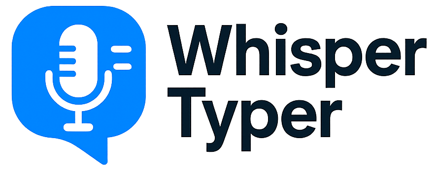
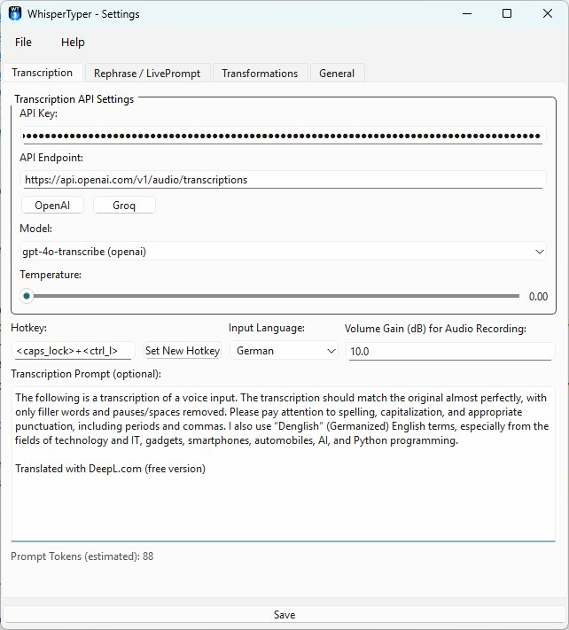
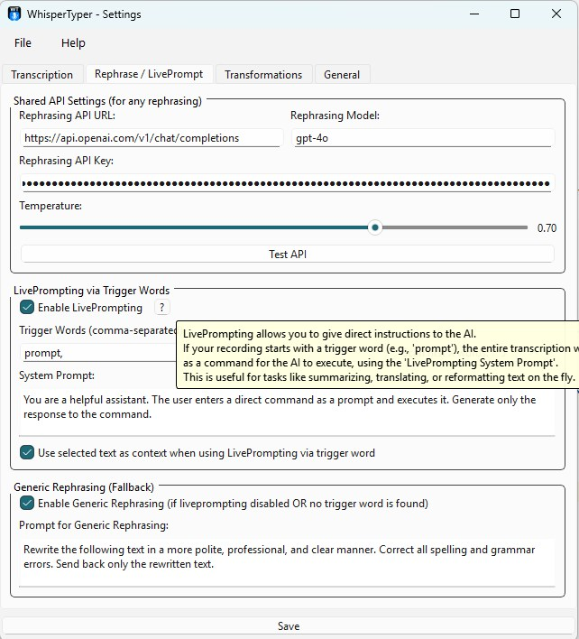
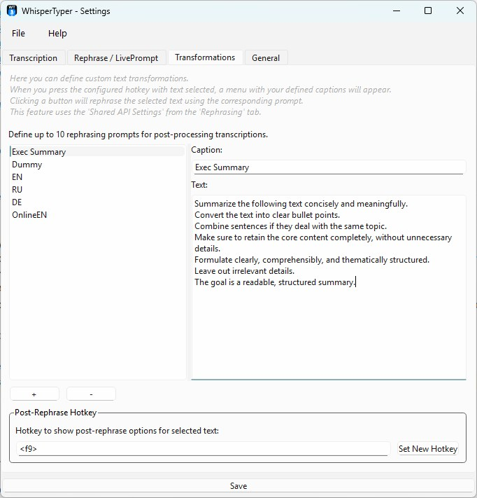
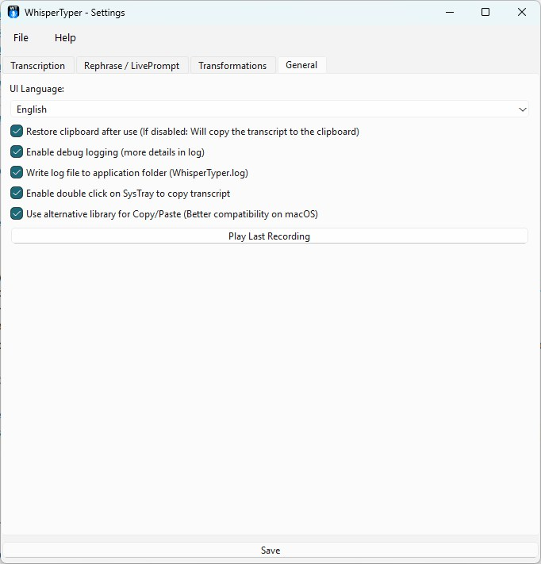
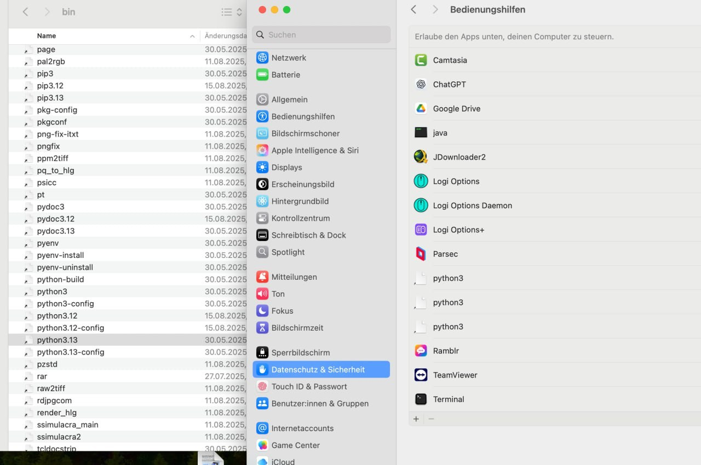

<h2 align="center">Transform your voice into text and AI prompts</h2>
<p align="center">
    
</p>


--------

<p align="center">
<!-- GitHub Stars Badge -->
<a href="https://github.com/bjspi/WhisperTyper" target="_blank">
    
</a>
<!-- Platform Support Badges -->


</p>

# Overview
- [Introduction](#ai-based-voice-transcriber--live-prompter)
- [Key-Features](#key-features)
- [Installation on Windows](#installation)
- [Installation on MacOS](#installation-on-macos)
- [Updating](#updating)
- [Tech Stack](#tech-stack)
- [Usage](#usage)

# 📖  AI-based Voice Transcriber & Live Prompter
A powerful, cross-platform voice-to-text application that integrates seamlessly into your workflow. 
Use your voice to type, rephrase text, or even prompt AI models on-the-fly, all controlled by a simple hotkey and running discreetly in your system tray.

This tool is designed for developers, writers, and anyone who wants to leverage the power of AI to type faster and smarter.

- 🎤 **Voice Typing**: Transcribe your voice into any application with a single hotkey.
- 🚀 **Live Voice Prompting**: Turn your voice into AI commands on the fly (_e.g. say: "`this is a prompt; write birthday wishes for my friend`" and the AI will type it out for you_)
- ✍️ **Preset-based Rephrasing**: Go beyond transcription with custom presets for text-transformation (_select text in any editable field and use your hotkey to rephrase it_)
- 🔧 **Custom APIs**: Supports OpenAI, Groq, and many more...
- 🤫 **Systray Icon**: Runs quietly in the background without clustering the Taskbar
- ⌨️ **Clipboard Safe**: Doesnt hijack your clipboard

## 📱 Screenshots

<p align="center">
    <a href="readme_images/screenshots/01.jpg" target="_blank">
        
    </a>&nbsp;
    <a href="readme/screenshots/02.jpg" target="_blank">
        
    </a>&nbsp;
    <a href="readme/screenshots/03.jpg" target="_blank">
        
    </a>&nbsp;
    <a href="readme/screenshots/04.jpg" target="_blank">
        
    </a>&nbsp;
</p>

---

## 💖 Key Features

-   **Global Voice Typing**: Transcribe your voice into any application with a single hotkey.
-   **AI-Powered**: Supports OpenAI (Whisper, GPT models), Groq and any other Whisper-API with identical API-design for fast and accurate transcription and rephrasing.
-   **LivePrompting**: A revolutionary feature! Use trigger words to turn your speech directly into a prompt for an AI, which then types out the result.
    -   *Example*: Speak `"prompt, write a short poem about rain"` and the AI will type the poem for you (based on your rephrasing prompt)
-   **Context-Aware Rephrasing**: Automatically use text you've highlighted on your screen as context for your voice prompts.
-   **Clipboard Safe**: Your clipboard is sacred. The app restores its previous content after pasting, so you never lose what you had copied. This is a major advantage over other tools that hijack your clipboard.
-   **Discreet Operation**: Runs quietly in the system tray without cluttering your taskbar (e.g., using `pythonw.exe` on Windows).
-   **Full Customization**:
    -   Customizable API endpoints, keys, models, and temperature settings for both transcription and rephrasing.
    -   Fine-tune transcription with custom prompts to improve accuracy for specific jargon or formatting.
    -   Adjustable microphone **volume gain** to boost input from quieter microphones, significantly increasing accuracy.
-   **Multi-Language UI**: The application interface is available in English, German, Spanish, and French.
-   **Cross-Platform**: Works on Windows, macOS, and Linux.

## ⬇️ Download & Installation

1.  Clone the repository (or download the ZIP file):
    ```bash
    git clone https://github.com/bjspi/WhisperTyper.git
    cd WhisperTyper
    ```
2.  Install the required Python packages:
    ```bash
    pip install -r requirements.txt
    ```
    > **Note for macOS users**: See full [macOS installation instructions](#installation-on-macos) below.
    
3.  Run the application, for headless operation on Windows, use `pythonw` instead of python:
    ```bash
    python run.py
    # or
    pythonw run.py
    ```

## ⬇️🍏 Installation on MacOS

This tool is fully functional on macOS but requires additional setup for microphone and hotkey access. For the best experience, creating a standalone App Bundle using PyInstaller is recommended. This allows you to grant the necessary Input Monitoring and Accessibility permissions in System Settings, ensuring seamless operation.

Known Issue: The hotkey-setting button in the UI is disabled on macOS to prevent a crash. To change hotkeys, please edit the input fields in the settings menu directly and restart the application for the changes to take effect.

1. Install PortAudio using Homebrew. This is necessary in any case.
    ```bash
    brew install portaudio
    ```

2. Install the required Python packages - this will install the requirements. If you want to work with a isolated virtual environment, you can create one first and activate it.
   ```bash
   # Create a virtual environment (optional but recommended)
    python3 -m venv venv
    source venv/bin/activate  # Activate the virtual 
   
   # Install the required packages (not optional)
    pip install -r requirements.txt
   ```

3. Either directly run from sources: Needs a workaround for permissions management:
   1. Locate your default Python environment (it may be managed by pyenv or another tool). You can check with:
       ```bash
       which python3
       ```
   
   2. Add your Python interpreter and Terminal to the **Accessibility** permissions as well as the microphone permissions:
       - Go to **System Settings** \> **Privacy & Security** \> **Accessibility**.
       - Click the **+** button and add the path to your Python executable (from step 2).
       - If you are using a virtual environment, add the path to the `python` executable inside your virtual environment's `bin` directory.
       - Example path: `/Users/yourusername/.pyenv/versions/3.11.4/bin/python3`
      <p align="center">
           
       </p>

   3. Start the application using your Python interpreter:
       ```bash
      # Optionally activate your virtual environment if you created one
       source venv/bin/activate  # If you created a virtual environment
      
      # Run the application
       python run.py
       ```
4. Optionally, you can create an App-bundle for easier access and separated Permissions-management:
   1. You'd need to install pyinstaller via pip:
    ```bash
    # If you are using a virtual environment, make sure it is activated
    source venv/bin/activate
   
    # Install pyinstaller globally or in your virtual environment
    pip install pyinstaller
    ```
   2. Then under directory deploy, `chmod +x deploy_mac.sh` and run the script. The app icons are already prepared as Iconset for Usage under MacOS, so you should not need to worry about any details creating the app bundle.
    ```bash
    ./deploy_mac.sh
    ```

5. In any case, when using your configured hotkey for the first time, macOS will prompt for microphone access. Allow it.
    <p align="center">
        
    </p>

## ↗️ Updating
To update the application, simply pull the latest changes from the repository if you've originally cloned it. If you downloaded the ZIP file, download the latest version and replace your old files with the new ones.
```bash
git pull origin main
```

Optionally if you run it as App Bundle under MacOS you can also run the deploy script again to update the app bundle:
```bash
# Optionally activate your virtual environment if you created one
source venv/bin/activate 

# Navigate to the deploy directory and create a new app bundle
cd deploy
chmod +x deploy_mac.sh
./deploy_mac.sh
```

[//]: # (## 🧑‍💻 Tech Stack)
[//]: # (<p align="center">)
[//]: # (  )
[//]: # (  )
[//]: # (</p>)

## 🤝  Contributing
Feel free to contribute to this project! Whether it's fixing bugs, adding features, or improving documentation, 
your contributions are welcome. 

Please follow the standard GitHub workflow: fork the repository, make your changes, and submit a pull request.
