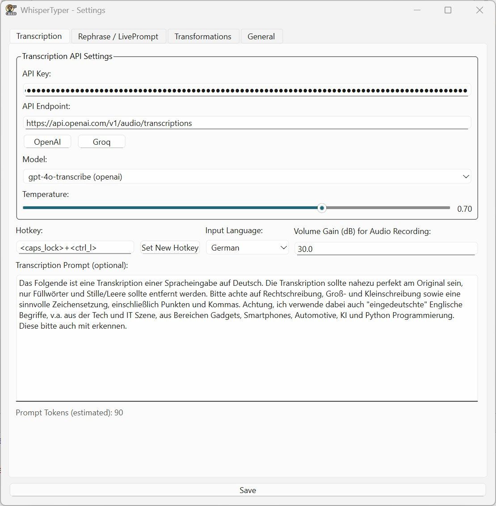
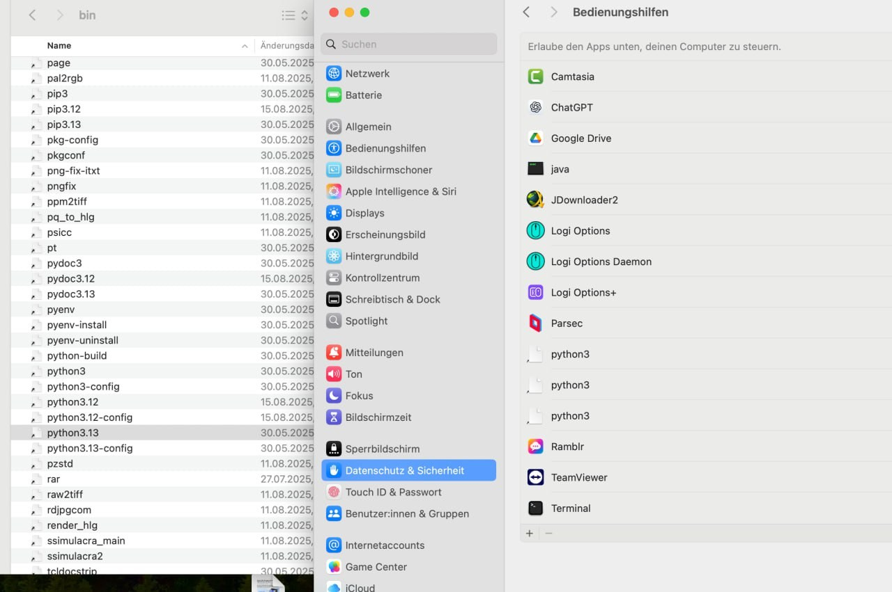
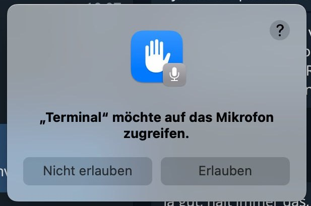

<p align="center">
  
</p>

--------

<p align="center">
  <!-- GitHub Stars Badge -->
  <a href="https://github.com/bjspi/WhisperTyper" target="_blank">
    
  </a>

  <!-- Platform Support Badges -->


</p>

# AI-based Voice Transcriber & Live Prompter

A powerful, cross-platform voice-to-text application that integrates seamlessly into your workflow. 
Use your voice to type, rephrase text, or even prompt AI models on-the-fly, all controlled by a simple hotkey and running discreetly in your system tray.

This tool is designed for developers, writers, and anyone who wants to leverage the power of AI to type faster and smarter.

- 🤫 **Discreet Systray Operation**: Runs quietly in the background.
- 🎤 **Global Voice Typing**: Transcribe your voice into any application with a single hotkey.
- 🚀 **Live Prompting**: Turn your voice into AI commands on the fly within any text field.
- ⌨️ **Clipboard Safe**: Doesnt hijack your clipboard, restores your previous clipboard contents after pasting
- 🔧 **Custom APIs**: Supports OpenAI, Groq, and any Whisper-compatible API
- ✍️ **Advanced Rephrasing**: Go beyond simple transcription with powerful and preset text transformations.

<p align="center">
    
</p>

---

## Key Features

-   **Global Voice Typing**: Transcribe your voice into any application with a single hotkey.
-   **AI-Powered**: Supports OpenAI (Whisper, GPT models), Groq and any other Whisper-API with identical API-design for fast and accurate transcription and rephrasing.
-   **LivePrompting**: A revolutionary feature! Use trigger words to turn your speech directly into a prompt for an AI, which then types out the result.
    -   *Example*: Speak `"prompt write a short poem about rain"` and the AI will type the poem for you (based on your rephrasing prompt)
-   **Context-Aware Rephrasing**: Automatically use text you've highlighted on your screen as context for your voice prompts.
-   **Clipboard Safe**: Your clipboard is sacred. The app restores its previous content after pasting, so you never lose what you had copied. This is a major advantage over other tools that hijack your clipboard.
-   **Discreet Operation**: Runs quietly in the system tray without cluttering your taskbar (e.g., using `pythonw.exe` on Windows).
-   **Full Customization**:
    -   Customizable API endpoints, keys, models, and temperature settings for both transcription and rephrasing.
    -   Fine-tune transcription with custom prompts to improve accuracy for specific jargon or formatting.
    -   Adjustable microphone **volume gain** to boost input from quieter microphones, significantly increasing accuracy.
-   **Multi-Language UI**: The application interface is available in English, German, Spanish, and French.
-   **Cross-Platform**: Works on Windows, macOS, and Linux.

## Installation

1.  Clone the repository (or download the ZIP file):
    ```bash
    git clone https://github.com/bjspi/WhisperTyper.git
    cd WhisperTyper
    ```
2.  Install the required Python packages:
    ```bash
    pip install -r requirements.txt
    ```
    > **Note for macOS users**: `PyAudio` has a dependency on `PortAudio`. If you encounter installation errors, please install it first using [Homebrew](https://brew.sh/):
    > `brew install portaudio`. See full [macOS installation instructions](#installation-on-macos) below.
    
3.  Run the application, for headless operation on Windows, use pythonw instead of python:
    ```bash
    python run.py
    ```

## Installation on MacOS

1. Install PortAudio using Homebrew:
    ```bash
    brew install portaudio
    ```
2. Locate your default Python environment (it may be managed by pyenv or another tool). You can check with:
    ```bash
    which python3
    ```
3. Install the required Python packages - this will install the requirements for the Python version you found in step 2:
    ```bash
    pip install -r requirements.txt
    ```
4. Add your Python interpreter to the **Accessibility** permissions:
    - Go to **System Settings** \> **Privacy & Security** \> **Accessibility**.
    - Click the **+** button and add the path to your Python executable (from step 2).
    - If you are using a virtual environment, add the path to the `python` executable inside your virtual environment's `bin` directory.
    - Example path: `/Users/yourusername/.pyenv/versions/3.11.4/bin/python3`
   

5. Start the application using your Python interpreter:
    ```bash
    python run.py
    ```

6. When using the hotkey for the first time, macOS will prompt for microphone access. Allow it.


## Tech Stack
<p align="center">
  
  
</p>

## Usage

1.  Run the application. On Windows, you can use `pythonw.exe WhisterTyper.py` to run it without a console window.
2.  An icon will appear in your system tray. Right-click it to access the settings.
3.  In the **Settings** window:
    -   **Transcription Tab**: Enter your API keys, select your preferred AI model, and set your recording hotkey.
    -   **Rephrase / LivePrompt Tab**: Enable rephrasing, set your trigger words, and write a default prompt to guide the AI.
    -   **General Tab**: Choose your UI language.
4.  Save your settings. The window will hide, and the app will run in the background.
5.  Click into any text field in any application and use your hotkey to start typing with your voice!
