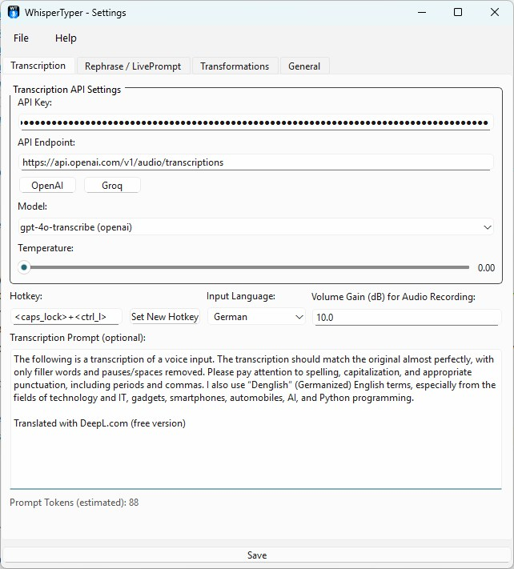
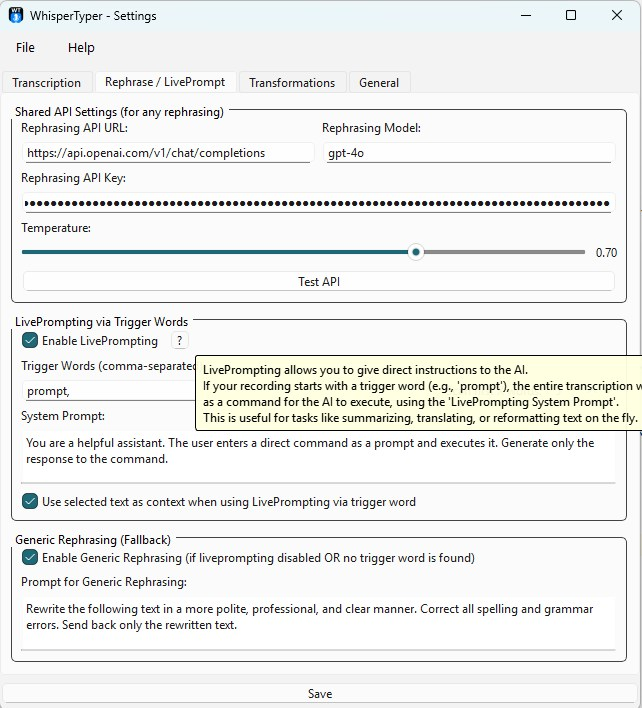
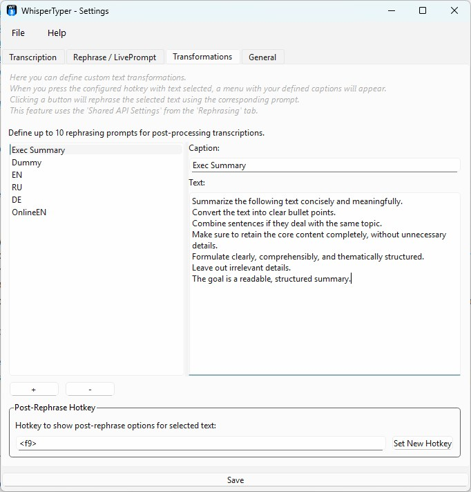
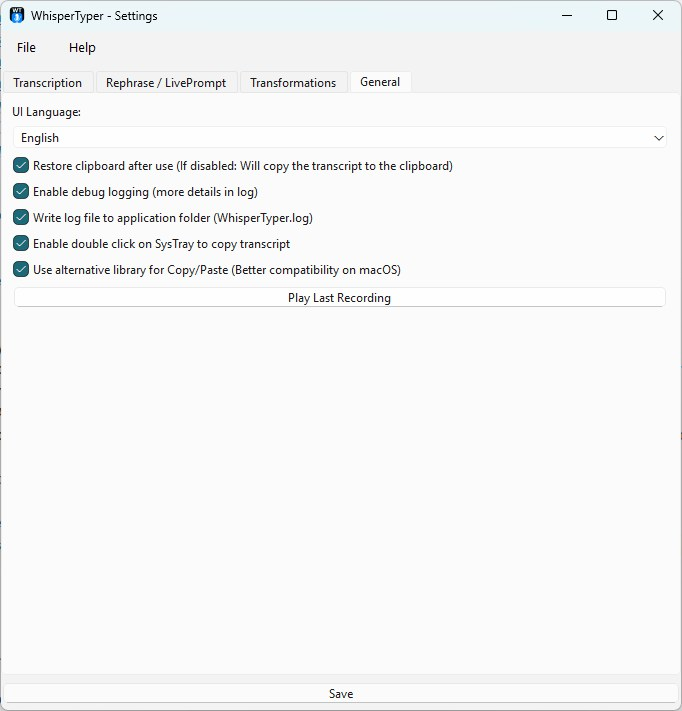

<h2 align="center">Transform your voice into text and AI prompts</h2>
<p align="center">
    
</p>

---

<p align="center">
<!-- Quality Badges -->

<a href="LICENSE">
    
</a>
<a href="https://github.com/astral-sh/ruff">
    
</a>
</p>
<p align="center">
<!-- Platform Support Badges -->


</p>
<p align="center">
  <a href="#--ai-based-voice-transcriber--live-prompter">Introduction</a> &#124;
  <a href="#-screenshots">Screenshots</a> &#124;
  <a href="#-key-features">Key-Features</a> &#124;
  <a href="#%EF%B8%8F-download--installation">Installation on Windows</a> &#124;
  <a href="#%EF%B8%8F-installation-on-macos">Installation on MacOS</a> &#124;
  <a href="#%EF%B8%8F-updating">Updating</a> &#124;
  <a href="#-architecture--development">Development</a> &#124;
  <a href="#--contributing">Contributing</a>
</p>

---

# 📖  AI-based Voice Transcriber & Live Prompter
A powerful, cross-platform voice-to-text application that integrates seamlessly into your workflow. 
Use your voice to type, rephrase text, or even prompt AI models on-the-fly, all controlled by a simple hotkey and running discreetly in your system tray.

This tool is designed for developers, writers, and anyone who wants to leverage the power of AI to type faster and smarter.

- 🎤 **Voice Typing**: Transcribe your voice into any application with a single hotkey.
- 🚀 **Live Voice Prompting**: Turn your voice into AI commands on the fly (_e.g. say: "`this is a prompt; write birthday wishes for my friend`" and the AI will type it out for you_)
- ✍️ **Preset-based Rephrasing**: Go beyond transcription with custom presets for text-transformation (_select text in any editable field and use your hotkey to rephrase it_)
- 🔧 **Custom APIs**: Supports OpenAI, Groq, and many more...
- 🤫 **Systray Icon**: Runs quietly in the background without cluttering the taskbar
- ⌨️ **Clipboard Safe**: Doesn't hijack your clipboard

## 📱 Screenshots

<p align="center">
    <a href="screenshots/app/01.jpg" target="_blank">
        
    </a>&nbsp;
    <a href="screenshots/app/02.jpg" target="_blank">
        
    </a>&nbsp;
    <a href="screenshots/app/03.jpg" target="_blank">
        
    </a>&nbsp;
    <a href="screenshots/app/04.jpg" target="_blank">
        
    </a>&nbsp;
</p>

## 💖 Key Features

-   **Global Voice Typing**: Transcribe your voice into any application with a single hotkey.
-   **AI-Powered**: Supports OpenAI (Whisper, GPT models), Groq and any other Whisper-API with identical API-design for fast and accurate transcription and rephrasing.
-   **LivePrompting**: A revolutionary feature! Use trigger words to turn your speech directly into a prompt for an AI, which then types out the result.
    -   *Example*: Speak `"prompt, write a short poem about rain"` and the AI will type the poem for you (based on your rephrasing prompt)
-   **Context-Aware Rephrasing**: Automatically use text you've highlighted on your screen as context for your voice prompts.
-   **Transcribe Audio & Video Files**: Pick an existing audio file (or, with **FFmpeg** installed, a video file — MP4, MOV, MKV, …) from the tray menu; the audio track is extracted to a temporary 128 kbps MP3 and transcribed. Set the FFmpeg path (or leave it empty to auto-detect on your `PATH`) on the Transcription settings page.
-   **Clipboard Safe**: Your clipboard is sacred. The app restores its previous content after pasting, so you never lose what you had copied. This is a major advantage over other tools that hijack your clipboard.
-   **Discreet Operation**: Runs quietly in the system tray without cluttering your taskbar (e.g., using `pythonw.exe` on Windows).
-   **Self-Updating**: When run from a cloned repo, a background watcher flags new versions with a green dot in the tray menu — one click updates and restarts the app.
-   **Full Customization**:
    -   Customizable API endpoints, keys, models, and temperature settings for both transcription and rephrasing.
    -   Fine-tune transcription with custom prompts to improve accuracy for specific jargon or formatting.
    -   Adjustable microphone **volume gain** to boost input from quieter microphones, significantly increasing accuracy.
-   **Multi-Language UI**: The application interface is available in English, German, Spanish, and French.
-   **Cross-Platform**: Works on Windows, macOS, and Linux.

## ⬇️ Download & Installation

> **💡 Recommended: clone the repo and run straight from the sources.** On Windows (and
> Linux) there is no need to build an .exe — the app runs perfectly from the Python
> sources, and a git clone unlocks the **built-in self-update**: WhisperTyper checks the
> repository in the background, shows a green dot on the tray menu's *Update* entry when
> a new version is available, and updates itself with one click. A ZIP download works
> too, but you lose the self-update. (On macOS an App Bundle is recommended instead —
> for permissions reasons, see the [macOS instructions](docs/INSTALL_MACOS.md).)

1.  Clone the repository:
    ```bash
    git clone https://github.com/bjspi/WhisperTyper.git
    cd WhisperTyper
    ```
2.  Install the required Python packages:
    ```bash
    pip install -r requirements.txt
    ```
    > **Note for macOS users**: See the full [macOS installation instructions](docs/INSTALL_MACOS.md).

    > **Optional — transcribe video files**: Install [FFmpeg](https://ffmpeg.org/download.html) to enable picking video files (MP4, MOV, MKV, …) for transcription. If it's on your `PATH` it is detected automatically; otherwise set its path on the Transcription settings page. On Windows: `winget install ffmpeg` (or `choco install ffmpeg`); on macOS: `brew install ffmpeg`; on Linux: `sudo apt install ffmpeg`.

3.  Run the application:
    ```bash
    python run.py
    ```
    **Tip (Windows):** start it with `pythonw` instead of `python` and no console (CMD)
    window appears at all — the app then lives purely in the system tray:
    ```bash
    pythonw run.py
    ```
    For a double-clickable launcher (e.g. as an autostart entry), drop this one-liner
    into a `start_hidden.cmd` next to `run.py`:
    ```bat
    start "WhisperTyper" /B pythonw.exe "%~dp0run.py" %*
    ```

## ⬇️🍏 Installation on macOS

macOS needs a few extra steps for microphone and hotkey permissions (ideally via an App
Bundle). The full guide lives in **[docs/INSTALL_MACOS.md](docs/INSTALL_MACOS.md)**.

## ↗️ Updating

**Running from a cloned repo (recommended):** WhisperTyper keeps itself up to date. A
background watcher periodically checks the repository and shows a green dot on the tray
menu's *Update* entry when a new version is available — one click pulls the update and
offers an immediate restart. No manual steps needed.

You can of course also update manually at any time:
```bash
git pull origin main
```

If you downloaded the ZIP file instead, download the latest version and replace your old files with the new ones.

If you run WhisperTyper as an App Bundle on macOS, see
[docs/INSTALL_MACOS.md](docs/INSTALL_MACOS.md#updating-the-app-bundle) for rebuilding the
bundle after an update.

## 🏗 Architecture & Development

The codebase is organized in strict layers — a pure, fully unit-tested core
(`app/core/`), self-contained worker services, thin platform adapters, and a Qt
composition root. The layering, threading model and design decisions are documented in
**[docs/ARCHITECTURE.md](docs/ARCHITECTURE.md)**.

```bash
# Dev setup
pip install -e ".[dev]"

# The same checks CI runs on Linux/Windows/macOS:
ruff check app tests run.py                                # lint
mypy app/core app/services app/audio app/hotkeys app/ui    # strict type-check
pytest                                                     # 100+ headless tests
```

Every push is verified by [GitHub Actions](https://github.com/bjspi/WhisperTyper/actions):
lint (ruff), type-checks (mypy) and the test suite across Python 3.10–3.13 on all three
platforms.

## 🤝  Contributing
Feel free to contribute to this project! Whether it's fixing bugs, adding features, or improving documentation, 
your contributions are welcome — see **[CONTRIBUTING.md](CONTRIBUTING.md)** for the dev setup and ground rules.

Please follow the standard GitHub workflow: fork the repository, make your changes, and submit a pull request.

## 📄 License

Released under the [MIT License](LICENSE).
