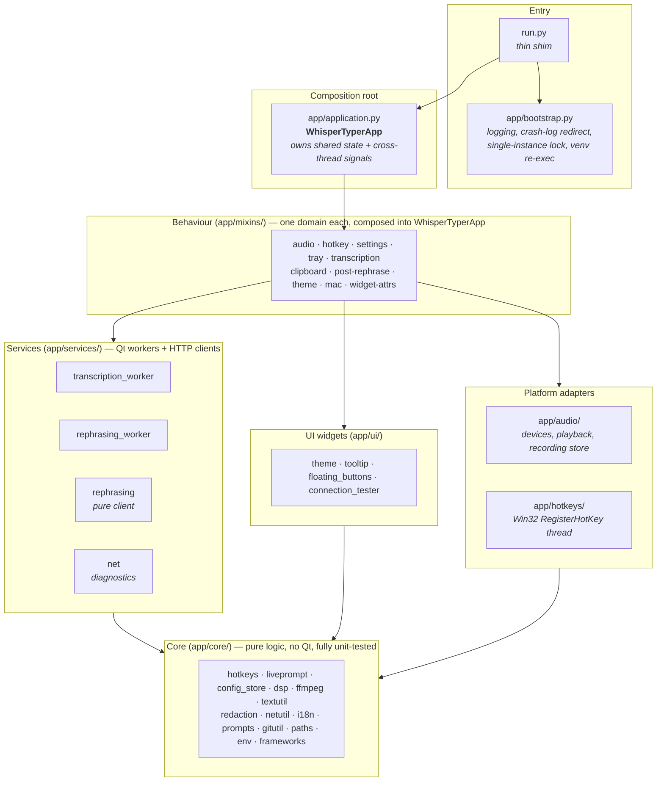
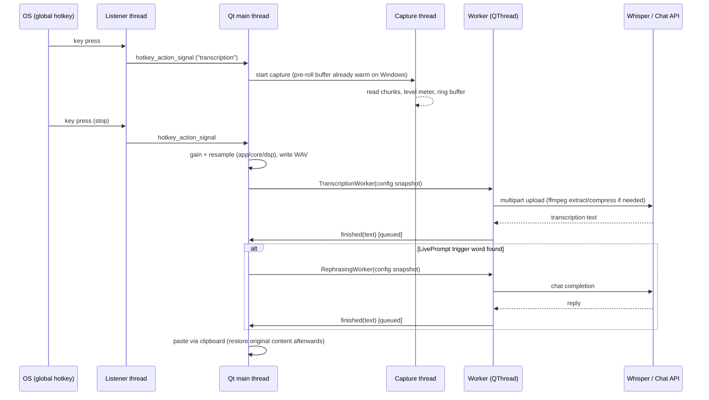

# WhisperTyper — Architecture

WhisperTyper is a PyQt6 tray application: a global hotkey records microphone audio, the
recording is transcribed by an OpenAI-compatible Whisper endpoint, and the result is typed
into whatever application has focus (or optionally routed through a chat-completion model
first — LivePrompt / rephrasing).

This document describes the layering, the threading model, and the reasoning behind the
less obvious design decisions.

## Layering

The codebase is organized as strict layers — lower layers never import from higher ones:

| Layer | Rules |
|---|---|
| `app/core/` | **Pure logic.** No Qt, no app state, no I/O side effects beyond what the function name says. Everything here is unit-testable headless — this is what the CI test suite covers. |
| `app/audio/`, `app/hotkeys/` | Platform adapters around PyAudio / Win32. Qt-free. |
| `app/services/` | One `QObject` worker per network round-trip, moved to its own `QThread`. Workers are **self-contained**: the caller snapshots all config values on the GUI thread and passes plain values in, so no worker ever reads shared mutable state from its own thread. |
| `app/ui/` | Small standalone widgets (tooltip, floating palette, QSS theme) with no knowledge of the application object. |
| `app/mixins/` | The application's behaviour, split by domain. Each mixin is a cohesive slice (recording lifecycle, hotkey listeners, settings window, tray menu, …) of the one `WhisperTyperApp` instance. |
| `app/application.py` | The composition root: declares the shared state in `__init__`, declares every cross-thread signal, and wires signals to slots. |

### Why mixins instead of separate objects?

The application object *is* the settings window (`uic.loadUi` injects ~90 widgets into
it), *and* the tray owner, *and* the recording controller — Qt strongly favours one
long-lived widget hierarchy here. Splitting the behaviour into mixins keeps each domain
readable and reviewable in isolation while sharing one `self`.

The trade-offs are managed explicitly:

- **All shared state is declared in one place** — `WhisperTyperApp.__init__`. Mixins never
  invent new cross-domain attributes silently.
- **Pure logic does not live in mixins.** Anything that can be expressed as a function of
  its inputs (hotkey grammar, LivePrompt triggers, config migrations, DSP, ffmpeg
  decisions) sits in `app/core/` where it is tested.
- mypy checks the Qt-free layers strictly; for `app.mixins.*` the duck-typed `self.*`
  member checks are disabled (see `pyproject.toml`) because the composed class is the
  real unit — it is exercised at runtime and via the listed contracts.

## Threading model

| Thread | Runs | Talks to the GUI via |
|---|---|---|
| **Qt main thread** | All widgets, tray menu, slots, result delivery (paste/clipboard) | direct calls |
| pynput global listener | `_on_hotkey_press/_release`, Win32 in-hook suppression filter | `hotkey_action_signal` (queued) |
| pynput capture listener | "Set hotkey" capture callbacks | `hotkey_capture_text_signal` / `hotkey_capture_finished_signal` (queued) |
| `WindowsHotkeyListener` | Win32 `RegisterHotKey` message loop | `hotkey_action_signal` (queued) |
| `QThread` workers | One HTTP request each (transcription / rephrasing) | worker signals (`finished` / `error`, queued) |
| Audio capture thread | `stream.read()` loop, pre-roll ring buffer, level meter | `show_tooltip_signal` (queued) |
| SoundPlayer daemon threads | Short WAV effect playback (writes serialized by a lock) | — |

**Rules enforced across the codebase:**

1. **No Qt object is ever touched off the main thread.** Background threads communicate
   exclusively through the queued signals declared on `WhisperTyperApp`.
2. **Workers receive value snapshots, never live references.** `TranscriptionWorker` and
   `RephrasingWorker` are constructed on the GUI thread with plain values copied out of
   the config, so a settings save can never race an in-flight request.
3. **Per-request context travels with the request.** Each transcription carries its own
   `output_mode` ("insert" vs. "clipboard") through the signal chain as a bound argument —
   concurrent requests cannot clobber each other's delivery.
4. **Shared collections are swapped, not mutated.** When hotkey listeners are rebuilt, the
   token/binding collections are replaced with fresh objects (an atomic reference swap)
   instead of being cleared under a reader.

## Data flow: one recording, end to end

## Design decisions worth knowing

- **Clipboard-based insertion.** Typing results via synthetic keystrokes breaks on
  non-ASCII text and IMEs; pasting via the clipboard is reliable. The user's original
  clipboard (including images, rich MIME payloads, and native binary formats) is captured
  first and restored with a small delay after the paste, because simulated Ctrl/Cmd+V only
  queues input and some target applications consume the clipboard asynchronously.
- **Two hotkey backends on Windows.** Combos that the OS can own (`RegisterHotKey`) use
  the native path — it needs no low-level keyboard hook. Combos involving Caps Lock or
  plain character keys must be *suppressed* so they don't reach the focused app; those go
  through a pynput low-level hook with an in-hook suppression filter. The decision logic
  is pure (`app/core/hotkeys.py`) and unit-tested.
- **"Keep mic hot" pre-roll (Windows).** Opening an input stream costs time, which used
  to clip the first syllable. A background reader keeps the stream open and maintains a
  ~0.75 s ring buffer that is prepended to each recording; an idle timeout releases the
  device when unused.
- **ffmpeg as an optional dependency.** Video containers get their audio extracted, and
  oversized files are re-encoded (mono 16 kHz MP3 — Whisper's internal format, so the
  compression is lossless for transcription quality) to fit the endpoint's upload limit.
  Everything degrades gracefully when ffmpeg is absent.
- **Config self-healing.** `ConfigStore` migrates legacy keys, repairs mojibake from
  historic encoding bugs (via `ftfy`), resets hotkeys polluted by captured control
  characters, and normalizes hotkey strings — all covered by tests.
- **Self-update via git.** When run from a source checkout, the tray offers a
  `git pull --ff-only` update; a background `git fetch` watcher shows a green dot when
  upstream is ahead. Frozen (PyInstaller) builds never see this menu entry.
- **Privacy in logs.** Transcripts and prompts are redacted in log output by default
  (`app/core/redaction.py`); only the first few characters survive.

## Testing strategy

The CI suite (`tests/`, 100+ tests) targets exactly the layers that are pure by
construction — it runs headless on Linux/Windows/macOS without PyQt6, PortAudio or a
display. GUI behaviour, listener lifecycles, and platform quirks are deliberately *not*
mocked into pseudo-coverage; they are kept thin, documented, and verified manually per
platform.
