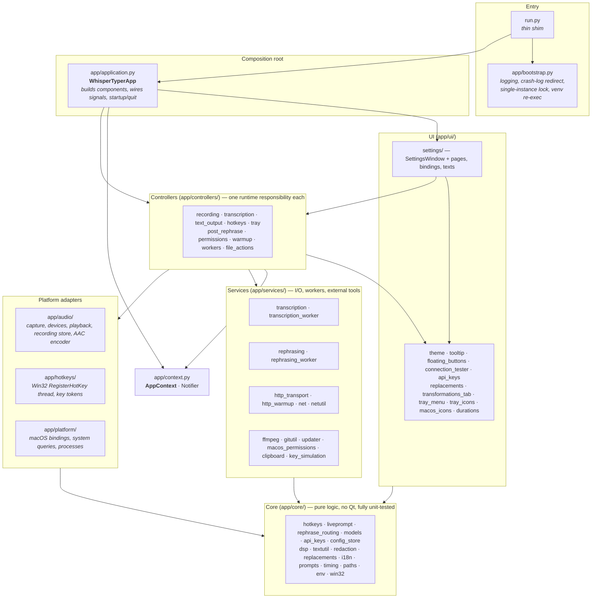
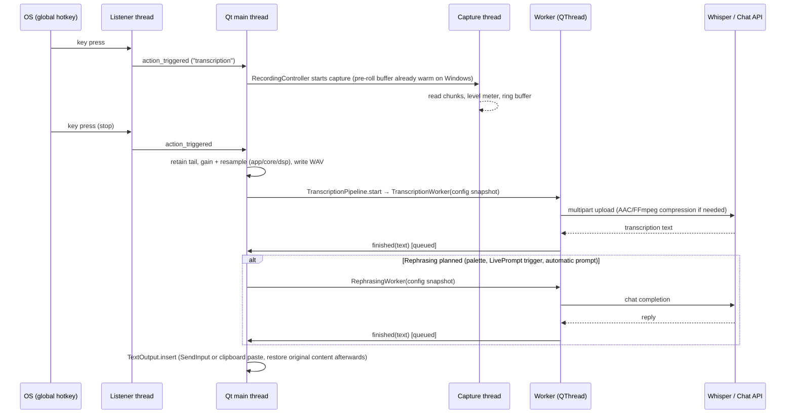

# WhisperTyper — Architecture

WhisperTyper is a PyQt6 tray application: a global hotkey records microphone audio, the
recording is transcribed by an OpenAI-compatible Whisper endpoint, and the result is typed
into whatever application has focus (or optionally routed through a chat-completion model
first — LivePrompt / rephrasing).

This document describes the layering, the threading model, and the reasoning behind the
less obvious design decisions.

## Layering

The codebase is organized as strict layers — lower layers never import from higher ones:

```mermaid
flowchart TB
    subgraph entry ["Entry"]
        RUN["run.py<br/><i>thin shim</i>"]
        BOOT["app/bootstrap.py<br/><i>logging, crash-log redirect,<br/>single-instance lock, venv re-exec</i>"]
    end

    subgraph comp ["Composition root"]
        APP["app/application.py<br/><b>WhisperTyperApp</b><br/><i>builds components, wires signals, startup/quit</i>"]
    end

    subgraph controllers ["Controllers (app/controllers/) — one runtime responsibility each"]
        CTRL["recording · transcription · text_output · hotkeys · tray<br/>post_rephrase · permissions · warmup · workers · file_actions"]
    end

    subgraph ui ["UI (app/ui/)"]
        SET["settings/ — SettingsWindow + pages, bindings, texts"]
        UIW["theme · tooltip · floating_buttons · connection_tester · api_keys<br/>replacements · transformations_tab · tray_menu · tray_icons · macos_icons · durations"]
    end

    subgraph services ["Services (app/services/) — I/O, workers, external tools"]
        TW["transcription · transcription_worker"]
        RW["rephrasing · rephrasing_worker"]
        NET["http_transport · http_warmup · net · netutil"]
        TOOLS["ffmpeg · gitutil · updater · macos_permissions · clipboard · key_simulation"]
    end

    subgraph platform ["Platform adapters"]
        AUD["app/audio/<br/><i>capture, devices, playback, recording store, AAC encoder</i>"]
        HK["app/hotkeys/<br/><i>Win32 RegisterHotKey thread, key tokens</i>"]
        OS["app/platform/<br/><i>macOS bindings, system queries, processes</i>"]
    end

    subgraph core ["Core (app/core/) — pure logic, no Qt, fully unit-tested"]
        CORE["hotkeys · liveprompt · rephrase_routing · models · api_keys · config_store<br/>dsp · textutil · redaction · replacements · i18n · prompts · timing · paths · env · win32"]
    end

    CTX["app/context.py<br/><b>AppContext</b> · Notifier"]

    RUN --> BOOT
    RUN --> APP
    APP --> controllers
    APP --> SET
    APP --> CTX
    SET --> controllers
    controllers --> CTX
    controllers --> services
    controllers --> platform
    controllers --> UIW
    SET --> UIW
    services --> core
    ui --> core
    platform --> core
```

| Layer | Rules |
|---|---|
| `app/core/` | **Pure logic.** No Qt, no app state, no I/O side effects beyond what the function name says. Everything here is unit-testable headless — this is what the CI test suite covers. |
| `app/audio/`, `app/hotkeys/`, `app/platform/` | Platform adapters around PyAudio / Win32 / macOS frameworks and OS processes. |
| `app/services/` | Network, external tools (FFmpeg, git), clipboard and permission APIs. Each network round-trip is a plain function (`transcribe`, `rephrase_text`) wrapped by one `QObject` worker on its own `QThread`. Workers are **self-contained**: the caller snapshots all config values on the GUI thread and passes plain values in, so no worker ever reads shared mutable state from its own thread. |
| `app/context.py` | `AppContext`: the shared configuration dict and its persistence, the translator, the thread-safe `Notifier` (status balloons), the recording store, and a `files_changed` signal for menus. |
| `app/controllers/` | The runtime behaviour, one class per responsibility (recording lifecycle, transcription pipeline, text insertion, hotkey listeners, tray menu, …). Each controller receives its collaborators in its constructor. |
| `app/ui/` | Widgets, painters and the settings window. `app/ui/settings/` holds `SettingsWindow` and its pages; the declarative `bindings`/`texts` tables load, save and translate the form. |
| `app/application.py` | The composition root: builds the context, controllers and windows, connects their signals and owns startup/quit. |

### Composition and dependencies

Every application component is its own object and receives exactly the collaborators it
uses in its constructor (the `AppContext`, or just the pieces it needs, plus explicit
references to other controllers). The composition root decides the wiring, so a
component's constructor documents its dependencies and tests can build it in isolation.

| Component | Owns | Reports through |
|---|---|---|
| `RecordingController` | microphone, warm-mic and on-demand capture, macOS recorder, prompt palette, push-to-talk flag | `state_changed(bool)` (tray icon, cancel action) |
| `TranscriptionPipeline` | transcription/rephrasing requests, rephrase routing, replacements, batch, last result | direct calls into `TextOutput` |
| `TextOutput` | SendInput / clipboard paste, delayed clipboard restore, selection reading | return values |
| `HotkeyController` | pynput / Win32 listeners, bindings, "Set hotkey" capture | `action_triggered(action, detected_ns)` |
| `PostRephraseController` | floating prompt palette for selected text | direct calls |
| `TrayController` | tray icon, menu, level meter, git updater | — |
| `MacPermissions` | one-time permission dialogs, startup prompts | — |
| `SettingsWindow` | the form, theme, translations | `saved`, `hotkeys_changed`, `language_changed` |
| `WarmupScheduler` / `WorkerThreads` | warm HTTP pool timer / QThread registry | — |

The settings window is one widget whose controls come from `main_window.ui`. Its pages
(`api_page`, `transcription_page`, `recording_page`, `general_page`, `theme_page`) are
slices of that single widget on top of `SettingsWindowBase`, which declares every control
so each page is type-checked on its own; they hold no state of their own.

**The recording hot path is a chain of direct calls on the GUI thread:** the queued hotkey
signal reaches `RecordingController`, which stops capture (retaining the in-flight block),
writes the WAV and calls `TranscriptionPipeline.start`; the worker's result handler calls
`TextOutput.insert`. Signals are used only where a thread boundary or a UI reaction (tray
icon, menus) requires them, so component boundaries add no queued hop or wait.

## Threading model

| Thread | Runs | Talks to the GUI via |
|---|---|---|
| **Qt main thread** | All widgets, tray menu, slots, result delivery (paste/clipboard) | direct calls |
| pynput global listener | `HotkeyController` press/release handlers, Win32 in-hook suppression filter | `action_triggered` (queued) |
| pynput capture listener | "Set hotkey" capture callbacks | capture preview/finish signals (queued) |
| `WindowsHotkeyListener` | Win32 `RegisterHotKey` message loop | `action_triggered` (queued) |
| `QThread` workers | One HTTP request each (transcription / rephrasing) | worker signals (`finished` / `empty` / `error`, queued) |
| Audio capture thread | `stream.read()` loop, pre-roll ring buffer, level meter | `Notifier` (queued) |
| SoundPlayer daemon threads | Short WAV effect playback (writes serialized by a lock) | — |

**Rules enforced across the codebase:**

1. **No Qt object is ever touched off the main thread.** Background threads communicate
   exclusively through signals of GUI-thread objects (`Notifier`, `HotkeyController`,
   `MacPermissions`, `RecordingController`, workers), which Qt queues onto the main thread.
2. **Workers receive value snapshots, never live references.** `TranscriptionWorker` and
   `RephrasingWorker` are constructed on the GUI thread with plain values copied out of
   the config, so a settings save can never race an in-flight request.
3. **Per-request context travels with the request.** Each transcription carries its own
   `output_mode` ("insert" vs. "clipboard") through the signal chain as a bound argument —
   concurrent requests cannot clobber each other's delivery.
4. **Shared collections are swapped, not mutated.** When hotkey listeners are rebuilt, the
   token/binding collections are replaced with fresh objects (an atomic reference swap)
   instead of being cleared under a reader.

## Data flow: one recording, end to end

```mermaid
sequenceDiagram
    participant OS as OS (global hotkey)
    participant L as Listener thread
    participant M as Qt main thread
    participant C as Capture thread
    participant W as Worker (QThread)
    participant API as Whisper / Chat API

    OS->>L: key press
    L->>M: action_triggered ("transcription")
    M->>C: RecordingController starts capture (pre-roll buffer already warm on Windows)
    C-->>C: read chunks, level meter, ring buffer
    OS->>L: key press (stop)
    L->>M: action_triggered
    M->>M: retain tail, gain + resample (app/core/dsp), write WAV
    M->>W: TranscriptionPipeline.start → TranscriptionWorker(config snapshot)
    W->>API: multipart upload (AAC/FFmpeg compression if needed)
    API-->>W: transcription text
    W->>M: finished(text) [queued]
    alt Rephrasing planned (palette, LivePrompt trigger, automatic prompt)
        M->>W: RephrasingWorker(config snapshot)
        W->>API: chat completion
        API-->>W: reply
        W->>M: finished(text) [queued]
    end
    M->>M: TextOutput.insert (SendInput or clipboard paste, restore original content afterwards)
```

## Design decisions worth knowing

- **Clipboard-based insertion.** Typing results via synthetic keystrokes breaks on
  non-ASCII text and IMEs; pasting via the clipboard is reliable. The user's original
  clipboard (including images, rich MIME payloads, and native binary formats) is captured
  first and restored with a small delay after the paste, because simulated Ctrl/Cmd+V only
  queues input and some target applications consume the clipboard asynchronously.
- **Two hotkey backends on Windows.** Combos that the OS can own (`RegisterHotKey`) use
  the native path — it needs no low-level keyboard hook. Combos involving Caps Lock or
  plain character keys must be *suppressed* so they don't reach the focused app; those go
  through a pynput low-level hook with an in-hook suppression filter. The decision logic
  is pure (`app/core/hotkeys.py`) and unit-tested.
- **"Keep mic hot" pre-roll (Windows).** Opening an input stream costs time, which can
  clip the first syllable. A background reader keeps the stream open and maintains a
  ~0.75 s ring buffer that is prepended to each recording; an idle timeout releases the
  device when unused.
- **ffmpeg as an optional dependency.** Video containers get their audio extracted, and
  oversized files are re-encoded (mono 16 kHz MP3 — Whisper's internal format, so the
  compression is lossless for transcription quality) to fit the endpoint's upload limit.
  Everything degrades gracefully when ffmpeg is absent.
- **Config self-healing.** `ConfigStore` migrates legacy keys, repairs mojibake from
  historic encoding bugs (via `ftfy`), resets hotkeys polluted by captured control
  characters, and normalizes hotkey strings — all covered by tests.
- **Self-update via git.** When run from a source checkout, the tray offers a
  `git pull --ff-only` update; a background `git fetch` watcher shows a green dot when
  upstream is ahead. Frozen (PyInstaller) builds never see this menu entry.
- **Privacy in logs.** Transcripts and prompts are redacted in log output by default
  (`app/core/redaction.py`); only the first few characters survive.

## Testing strategy

The CI suite (`tests/`) targets the layers that are pure by construction — it runs
headless on Linux/Windows/macOS without PyQt6, PortAudio or a display. Controllers are
exercised with fakes where their behaviour matters (clipboard restore, SendInput fallback,
capture tail retention, the recording → transcription → output milestones); the Qt-backed
tests run in the Windows CI job. Listener lifecycles and platform quirks are kept thin
and verified manually per platform (`tests/runtime_smoke.py` drives the real application).
