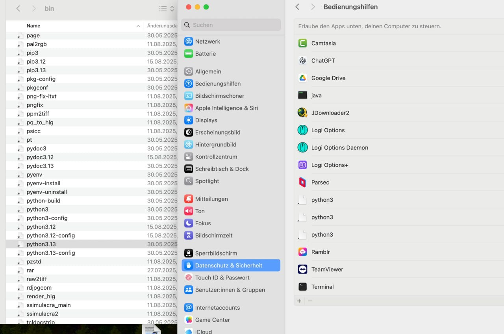
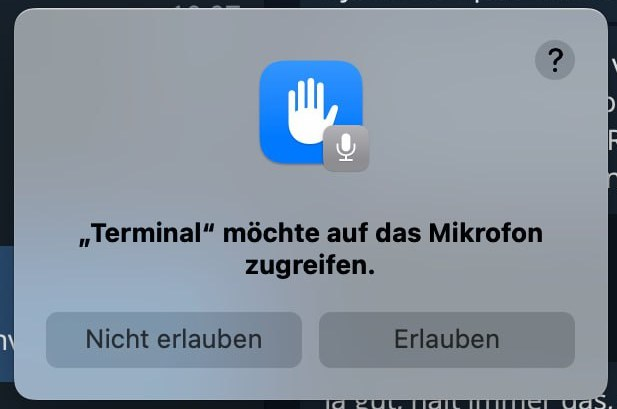

# Installation on macOS 🍏

WhisperTyper is fully functional on macOS but requires additional setup for microphone and
hotkey access. For the best experience, creating a standalone App Bundle using PyInstaller
is recommended. This allows you to grant the necessary Input Monitoring and Accessibility
permissions in System Settings, ensuring seamless operation.

Hotkeys on macOS can be set with the button in the settings window. Manual input works
too, and accepts both plain values like `F9` / `Cmd+Shift+F` and the legacy format such as
`<f9>` / `<cmd>+<shift>+f`.

## 1. Install PortAudio

Required in any case:

```bash
brew install portaudio
```

## 2. Install the Python packages

If you want an isolated virtual environment, create and activate it first.

```bash
# Create a virtual environment (optional but recommended)
python3 -m venv venv
source venv/bin/activate

# Install the required packages (not optional)
pip install -r requirements.txt
```

## 3. Recommended: build an App Bundle

This is the recommended way on macOS for proper permission management — the bundle gets
its own identity in System Settings.

1. Install PyInstaller:
    ```bash
    # If you are using a virtual environment, make sure it is activated
    source venv/bin/activate

    pip install pyinstaller
    ```

2. Then in the `deploy` directory, run the build script. The app icons are already
   prepared as an Iconset for macOS, so no extra steps are needed.
    ```bash
    cd deploy
    chmod +x deploy_mac.sh
    ./deploy_mac.sh
    ```

3. **For stable macOS permissions across app updates, always sign the App Bundle with the
   same signing identity.** Otherwise macOS may treat each replaced build like a new app
   and you may have to re-grant Input Monitoring and Accessibility permissions again.
    ```bash
    export WHISPERTYPER_CODESIGN_IDENTITY="Developer ID Application: Your Name (TEAMID)"
    ./deploy_mac.sh
    ```
    If you do not have an Apple Developer certificate, a local self-signed code signing
    certificate can also be used for your own builds, as long as you reuse the same
    identity every time.

4. In the `dist` folder you'll find the App Bundle. On first launch, the app proactively
   asks for the important macOS permissions it needs — microphone access, Input
   Monitoring and Accessibility. Grant them when prompted.

## 4. Alternative: run directly from the sources

Instead of building a bundle, you can run from the sources. This needs a workaround for
permission management:

1. Locate your default Python environment (it may be managed by pyenv or another tool):
    ```bash
    which python3
    ```

2. Add your Python interpreter and Terminal to the **Accessibility** permissions as well
   as the microphone permissions:
    - Go to **System Settings** > **Privacy & Security** > **Accessibility**.
    - Click the **+** button and add the path to your Python executable (from step 1).
    - If you are using a virtual environment, add the path to the `python` executable
      inside your virtual environment's `bin` directory.
    - Example path: `/Users/yourusername/.pyenv/versions/3.11.4/bin/python3`
    <p align="center">
        
    </p>

3. Start the application using your Python interpreter:
    ```bash
    # Optionally activate your virtual environment if you created one
    source venv/bin/activate

    python run.py
    ```

4. When running from source instead of the App Bundle, macOS may still ask for microphone
   access when you first start recording. Allow it there as well.
    <p align="center">
        
    </p>

## Updating the App Bundle

If you run WhisperTyper as an App Bundle, pull the latest sources and run the deploy
script again:

```bash
git pull origin main

# Optionally activate your virtual environment if you created one
source venv/bin/activate

# Optional but recommended for stable macOS permissions across updates
export WHISPERTYPER_CODESIGN_IDENTITY="Developer ID Application: Your Name (TEAMID)"

cd deploy
chmod +x deploy_mac.sh
./deploy_mac.sh
```

(When running from the sources instead, the tray menu's built-in self-update works on
macOS too — see the [README's Updating section](../README.md#%EF%B8%8F-updating).)
